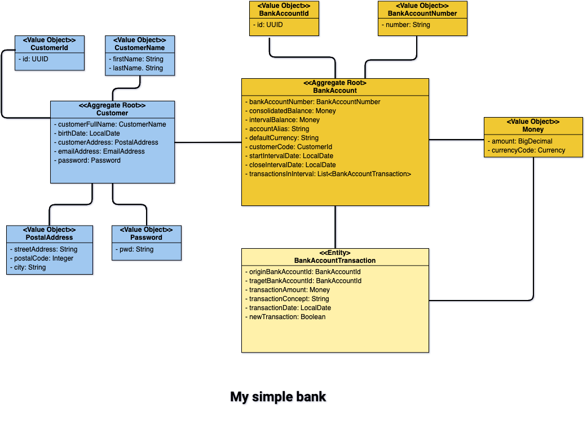

# 🏦🏦 My simple bank API 🏦🏦

Simple API developed following Domain Driven Design (DDD) and Hexagonal architecture.

## Tech stack
- Java 17
- Spring Boot
- Spring Data JPA
- Spring Hateoas
- In-memory database - H2
- Bcrypt
- Lombok
- OpenAPI
- ArchUnit

## Running in local
You can run the application executing the following command
```
mvn clean spring-boot:run -f my-bank-infrastructure/pom.xml
```
Also, you can execute the application directly from the IDE
of your preference.

## Testing the API
Within the repository there is a Postman collection which can be used to
test the different API operations. It is present in the **postman** folder.

If you prefer, you can use Swagger UI to test your API. Once your application is running,
go to _http://localhost:8080/api-doc.html_, from your browser.

## Solution
Diagram:


